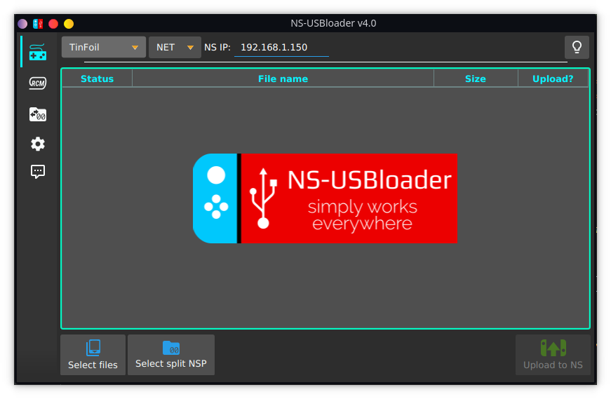
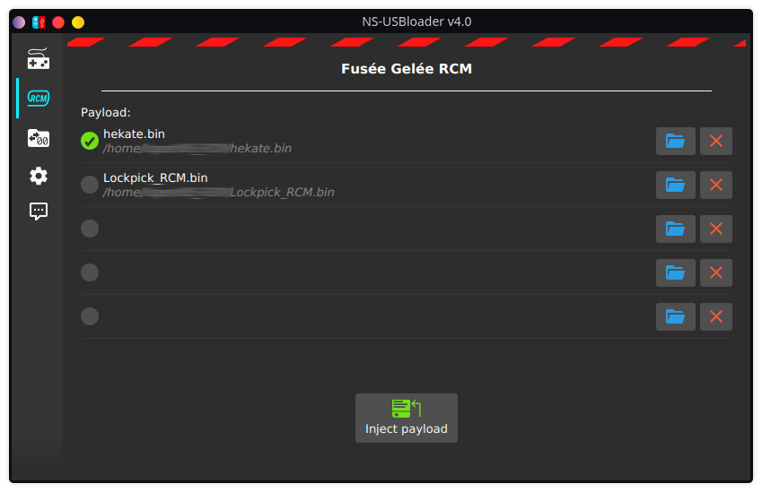
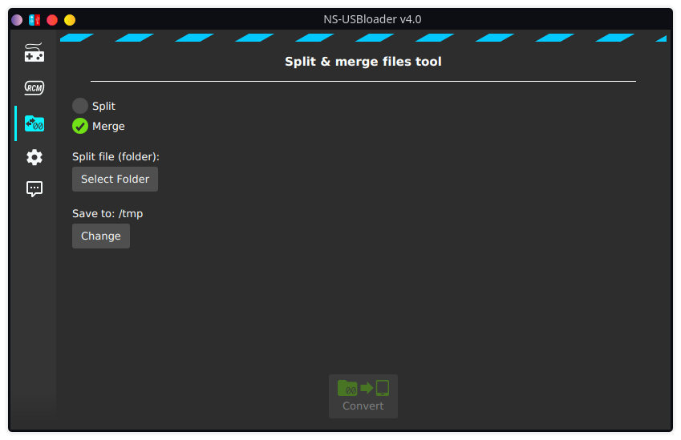
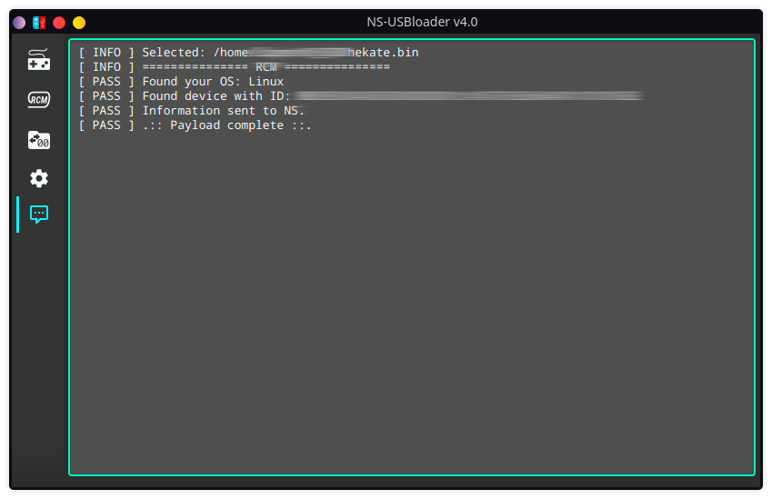

# NS-USBloader

  

[Support author](#support-this-app)

NS-USBloader is:
* A PC-side installer for **[Adubbz/TinFoil (v0.2.1)](https://github.com/Adubbz/Tinfoil/)**, **[Huntereb/Awoo-Installer](https://github.com/Huntereb/Awoo-Installer)** (USB and Network supported) and **[XorTroll/GoldLeaf](https://github.com/XorTroll/Goldleaf)** (USB) NSP installer. 
Replacement for default **usb_install_pc.py**, **remote_install_pc.py**, **GoldTree**/**Quark**. 
* This application also could be used as RCM payload on Windows, MacOS and Linux (supported arch: x86, x86_64 and Raspberry Pi).
* And of course it's a tool for split files! 
* And also for merging split-files into one :) 

[Click here for Android version ;)](https://github.com/developersu/ns-usbloader-mobile)

With GUI and cookies. Works on Windows, macOS and Linux.

Sometimes I add new posts about this project [on my home page](https://developersu.blogspot.com/search/label/NS-USBloader).

  
    
  

#### License

[GNU General Public License version 3](https://github.com/developersu/ns-usbloader/blob/master/LICENSE), or (at your option) any later version.

#### Used libraries & resources
* [OpenJFX](https://wiki.openjdk.java.net/display/OpenJFX/Main)
* [usb4java](https://mvnrepository.com/artifact/org.usb4java/usb4java)
* Few icons taken from: [materialdesignicons.com](http://materialdesignicons.com/)
* Information, ideas and data from ['fusee-launcher'](https://github.com/reswitched/fusee-launcher) application
* [Apache Commons CLI](https://commons.apache.org/proper/commons-cli/)

### List of awesome code contributors, translators and other great people!

* [Pablo Curiel (DarkMatterCore)](https://github.com/DarkMatterCore)
* [wolfposd](https://github.com/wolfposd)


* French by [Stephane Meden (JackFromNice)](https://github.com/JackFromNice) 
* Italian by [unbranched](https://github.com/unbranched)
* Korean by [DDinghoya](https://github.com/DDinghoya)
* Portuguese by [almircanella](https://github.com/almircanella)
* Spanish by [/u/cokimaya007](https://www.reddit.com/u/cokimaya007), Kuziel Alejandro
* Chinese (Simplified) by [Huang YunKun (htynkn)](https://github.com/htynkn), [exiori](https://github.com/exiori)
* German by [Swarsele](https://github.com/Swarsele)
* Vietnamese by [Hai Phan Nguyen (pnghai)](https://github.com/pnghai)
* Czech by [Spenaat](https://github.com/spenaat)
* Chinese (Traditional) by [qazrfv1234](https://github.com/qazrfv1234)
* Arabic by [eslamabdel](https://github.com/eslamabdel)

### System requirements

JRE/JDK 8u60 or higher for Windows

JDK 11 for MacOS and Linux

### Supported GoldLeaf versions
| GoldLeaf version | NS-USBloader version |
| ---------------- | -------------------- |
| v0.5             | v0.4 - v0.5.2, v0.8+ |
| v0.6             | none                 |
| v0.6.1           | v0.6                 |
| v0.7 - 0.7.3     | v0.7+                |
| v0.8             | v1.0+                |

where '+' means 'any next NS-USBloader version'.

### Awoo Installer support

Awoo Installer uses the same command-set (or 'protocol') to TinFoil. So just select 'TinFoil' in case you're going to use Awoo.

Also, please go to 'Settings' tab of NS-USBloader after first installation and check 'Allow XCI / NSZ / XCZ files selection for TinFoil' option. This installer can install not only NSPs but a way more formats!

### Usage
##### Linux:

1. Install JRE/JDK 8u60 or higher (openJDK is good. Oracle's one is also good). JavaFX not needed (it's embedded).

2. `root # java -jar /path/to/NS-USBloader.jar`

3. Optional: add user to 'udev' rules to use NS not-from-root-account
```
root # vim /etc/udev/rules.d/99-NS.rules
SUBSYSTEM=="usb", ATTRS{idVendor}=="057e", ATTRS{idProduct}=="3000", GROUP="plugdev"
root # udevadm control --reload-rules && udevadm trigger
```
4. For RCM part
```
root # vim /etc/udev/rules.d/99-NS-RCM.rules
SUBSYSTEM=="usb", ATTRS{idVendor}=="0955", ATTRS{idProduct}=="7321", GROUP="plugdev"
root # udevadm control --reload-rules && udevadm trigger
```

Please note: you may have to change 'plugdev' group from example above to the different one. It depends on you linux distro.

##### Raspberry Pi

1. Install JDK: `sudo apt install default-jdk`

2. For UI install JavaFX: `sudo apt install openjfx`

3. See steps 3 and 4 from 'Linux' section to  update 'udev'.

##### macOS

Double-click on downloaded .jar file. Follow instructions. Or see 'Linux' section.

Set 'Security & Privacy' settings if needed.

*Please note: JDK 11 is recommended for using on MacOS. There are few really weird issues already reported from JDK 14 users on Mac.*

##### Windows: 

* [Download and install Java JRE](http://java.com/download/) (8u60 or higher)
* Get this application (JAR file) and double-click on on it (alternatively open 'cmd', go to place where jar located and execute via `java -jar thisAppName.jar`)
* Once application opens click on 'Gear' icon. 
* Click 'Download and install drivers'
* Install drivers

#### And how to use it?

The first thing you should do it install TinFoil ([Adubbz](https://github.com/Adubbz/Tinfoil/)), GoldLeaf ([XorTroll](https://github.com/XorTroll/Goldleaf)) or Awoo ([Huntereb](https://github.com/Huntereb/Awoo-Installer)) on your NS. 

Take a look on app, find where is the option to install from USB and/or Network. Maybe [this article (about TinFoil)](https://developersu.blogspot.com/2019/02/ns-usbloader-en.html) will be helpful.

#### In details

There are three tabs. First one is main.

##### 'Gamepad' tab.

At the top of you selecting from drop-down application and protocol that you're going to use. For GoldLeaf only USB is available. Lamp icon stands for switching themes (light or dark).

Then you may drag-n-drop files (split-files aka folders) to application or use 'Select NSP files' button. Multiple selection for files available. Click it again and select files from another folder it you want, it will be added into the table.

Table.

There you can select checkbox for files that will be send to application (TF/GL). ~~Since GoldLeaf allow you only one file transmission per time, only one file is available for selection.~~ 

Also you can use space to select/un-select files and 'delete' button for deleting. By right-mouse-click you can see context menu where you can delete one OR all items from the table.

For GoldLeaf v0.6.1 and NS-USBloader v0.6 (and higher) you will have to use 'Explore content' -> 'Remote PC (via USB)' You will see two drives HOME:/ and VIRT:/. First drive is pointing to your home directory. Second one is reflection of what you've added to table (first application tab). Also VIRT:/ drive have limited functionality in comparison to HOME:/. E.g. you can't write files to this drive since it's not a drive. But don't worry, it won't make any impact on GoldLeaf or your NS if you try.

Also, for GoldLeaf write files (from NS to PC): You have to 'Stop execution' properly before accessing files transferred from GL. Usually you have to wait 5sec or less. It will guarantee that your files properly written to PC.

##### 'RCM' tab

On this tab you can select payloader like Hekate or LockPick_RCM and send it to NS. Drag-n-drop supported. Also some in-app validations for payload takes place ;)

##### 'Folder with arrows and zeroes' tab

On this tab you can split and merge files. Select 'Split' or 'Merge' and split (or merge).

##### 'Gears' tab.

Here you can configure settings for network file transmission. Usually you shouldn't change anything. But it you're cool hacker, go ahead! The most interesting option here is 'Don't serve requests'. Architecture of the TinFoil's NET part is working interesting way. When you select in TF network NSP transfer, application will wait at port 2000 for the information about where should it take files from. Like '192.168.1.5:6060/my file.nsp'. Usually NS-USBloader serves requests by implementing simplified HTTP server and bringing it up and so on. But if this option selected, you can define path to remote location of the files. For example if you set in settings '192.168.4.2:80/ROMS/NS/' and add in table file 'my file.nsp' then NS-USBloader will simply tell TinFoil "Hey, go take files from '192.168.4.2:80/ROMS/NS/my%20file.nsp' ". Of course you have to bring '192.168.4.2' host up and make file accessible from such address (just go install nginx). As I said, this feature is interesting, but I guess won't be popular.

Also here you can:
* Set 'Auto-check for updates' for checking for updates when application starts, or click button to verify if new version released immediately.
* Set 'Show only *.nsp in GoldLeaf' to filter all files displayed at HOME:/ drive. So only NSP files will appear.

##### 'Dialog with three dots' tab.

That's where all logs dropped. Verbose information about transmissions comes here.


##### CLI (command line interface)

To get help run ``$ java -jar ns-usbloader-4.0.jar --help``

```
 -c,--clean                      Remove/reset settings and exit
 -g,--goldleaf <...>             Install via GoldLeaf mode. Check '-g help' for information.
 -h,--help                       Show this help
 -m,--merge <...>                Merge files. Check '-m help' for information.
 -n,--tfn <...>                  Install via Tinfoil/Awoo Network mode. Check '-n help' for information.
 -r,--rcm <[PATH/]payload.bin>   Send payload
 -s,--split <...>                Split files. Check '-s help' for information.
 -t,--tinfoil <FILE...>          Install via Tinfoil/Awoo USB mode.
 -v,--version                    Show application version
```

For more complex commands help use help argument after the fists key. For example: 

```
$ java -jar ns-usbloader-4.0.jar -n help

Usage:
        ns-usbloader -n nsip=<arg1> [hostip=<arg2>] FILE1 ...
        ns-usbloader --tfn nsip=<arg1> [hostip=<arg2>] FILE1 ...

Options:
        nsip=<ip>               Define NS IP address (mandatory)
        hostip=<ip[:port]>      Define this host IP address. Will be obtained automatically if not set.
```

Usage examples:

```
Send RCM payload:
$ java -jar ns-usbloader-4.0.jar -r C:\Users\Superhero\hekate.bin
Send files to Awoo Installer via Net-install: 
$ java -jar ns-usbloader-4.0.jar -n nsip=192.168.0.1 ./file.nsz ./file.nsp ~/*.xci
Send files to GoldLeaf v0.8:
$ java -jar ns-usbloader-4.0.jar -g ver=v0.8 ./*
Split files:
$ java -jar ns-usbloader-4.0.jar -s /tmp/ ~/*.nsp
Merge files:
$ java -jar ns-usbloader-4.0.jar -m /tmp/ ~/*.nsp
```

### Other notes

'Status' = 'Uploaded' that appears in the table does not mean that file has been installed. It means that it has been sent to NS without any issues! That's what this app about. 
Handling successful/failed installation is a purpose of the other side application: TinFoil or GoldLeaf. And they don't provide any feedback interfaces so I can't detect success/failure.

usb4java since NS-USBloader-v0.2.3 switched to 1.2.0 instead of 1.3.0. This should not impact anyone except users of macOS High Sierra (and Sierra, and El Capitan) where previous versions of NS-USBloader didn't work. Now builds with usb4java-1.2.0 marked as '-legacy' and builds with usb4java-1.3.0 doesn't have postfixes.

### Translators!
If you want to see this app translated to your language, go grab [this file](https://github.com/developersu/ns-usbloader/blob/master/src/main/resources/locale.properties) and translate it.

Upload somewhere (create PR, use pastebin/google drive/whatever else). [Create new issue](https://github.com/developersu/ns-usbloader/issues) and post a link. I'll grab it and add.

To convert files of any locale to readable format (and vise-versa) you can use this site [https://itpro.cz/juniconv/](https://itpro.cz/juniconv/)

#### TODO (maybe):
- [x] [Android support](https://github.com/developersu/ns-usbloader-mobile)

## Support this app


If you like this app, just give a star. 

If you want to make a donation*, please see below:

<a href="https://liberapay.com/developersu/donate"></a>

<a href="https://paypal.me/developersu" title="PayPal"></a>

[Yandex.Money](https://money.yandex.ru/to/410014301951665)

* Please note: this is non-commercial application.

Thanks

Appreciate assistance and support of both [Vitaliy](https://github.com/SebastianUA) and [Konstantin](https://github.com/konstantin-kelemen). Without you all this magic would not have happened.
